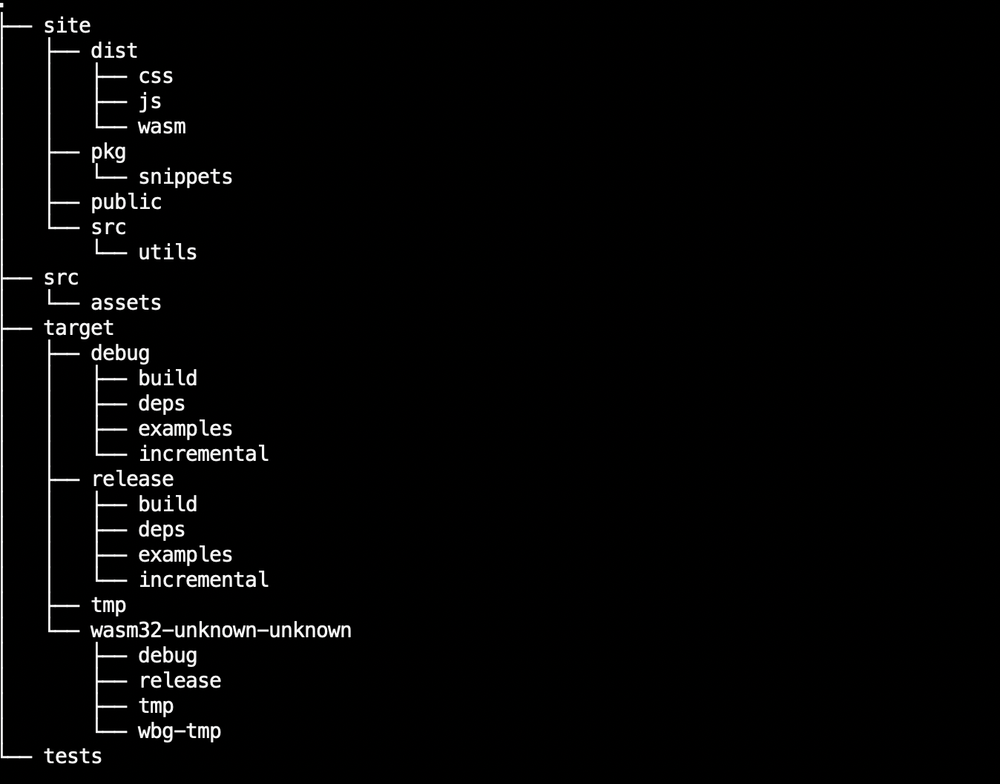
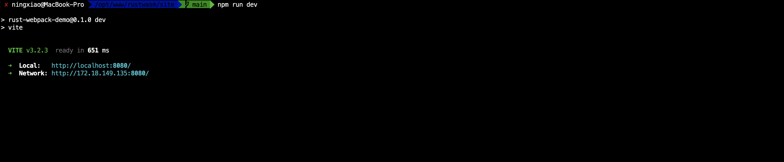
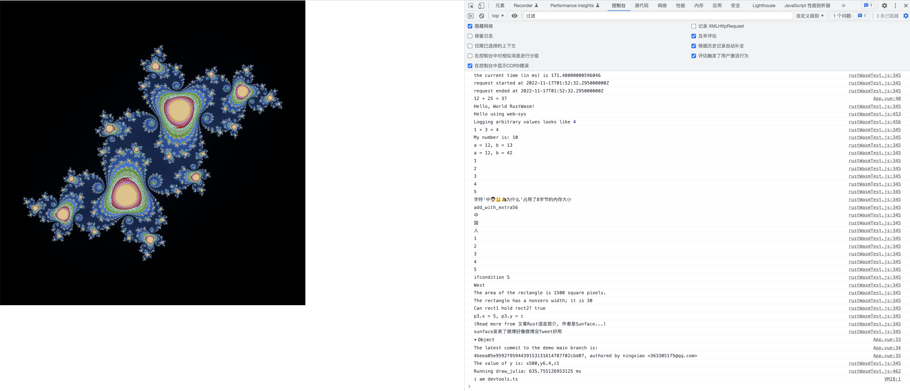
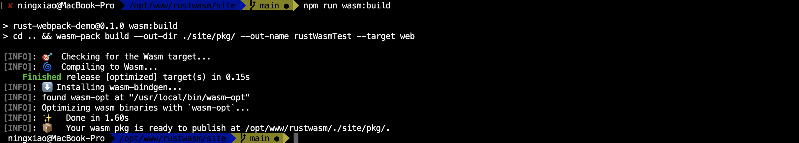

<div align="center">

  <h1><code>rust-wasm-vite-demo</code></h1>

  <strong>Rust转为WebAssembly（<a href="https://github.com/rustwasm/wasm-pack">wasm-pack</a>）结合Vite构建</strong>

  <p>
    <a href="https://travis-ci.org/rustwasm/wasm-pack-template"></a>
  </p>

  <h3>
    <a href="https://rustwasm.github.io/docs/wasm-pack/tutorials/npm-browser-packages/index.html">Tutorial</a>
    <span> | </span>
    <a href="https://discordapp.com/channels/442252698964721669/443151097398296587">Chat</a>
  </h3>

  <sub>Built with 🦀🕸 by <a href="https://rustwasm.github.io/">The Rust and WebAssembly Working Group</a></sub>
</div>

## About

[**📚 目录结构! 📚**]

```
cd site
pnpm install
tree -d -I '*node_module*' -L 3
```


### 🚴 Start

```
cd site
npm run dev
```



### 🛠️ Build with `npm run wasm:build`

```
cd site
npm run wasm:build
```

### 🔬 Test in Headless Browsers with `npm run wasm:test`

```
cd site
npm run wasm:test
```

### 🎁 Publish to NPM with `wasm:publish`

```
cd site
npm run wasm:publish
```